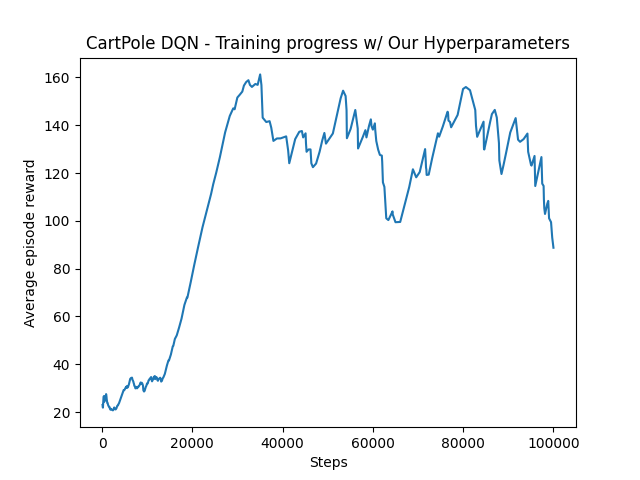
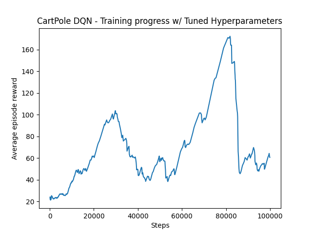

## CartPole 

CartPole is a classic reinforcement learning problem where the goal is to balance a pole on a cart. The cart can move left or right, and the agent must learn to apply forces to keep the pole upright. The environment is a simple 2D simulation where the cart can move along a track, and the pole is attached to the cart with a hinge. The agent receives a reward for each time step the pole remains upright and a penalty if it falls over or the cart moves out of bounds.

We have implemented two different reinforcement learning algorithms to solve the CartPole problem: A2C (Advantage Actor-Critic) and DQN (Deep Q-Network). For the A2C algorithm we were able to achieve a good performance with a mean reward of 10 for the hyperparameters we had used previously, which raises the point for impact on different implementations. After searching for a bit we reached an open-source github repository, [rl-baselines3-zoo](https://github.com/DLR-RM/rl-baselines3-zoo), which has hyperparameters for different algorithms and environments. After using the ones provided for DQN we were able to achieve a better performence, but no were near the optimal performance, something the A2C did very well. The results can be seen below in the graphs for each individual implementation:

### A2C

### DQN - Our Hyperparameters

### DQN - Hyperparameters from rl-baselines3-zoo

