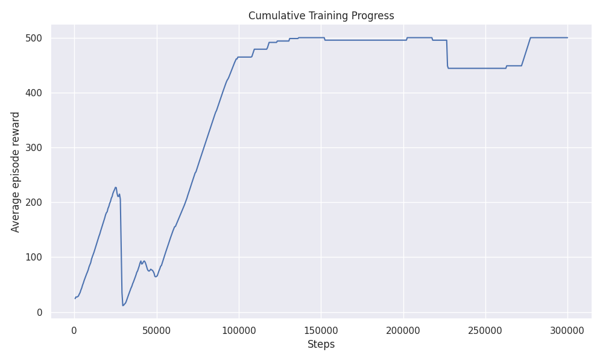
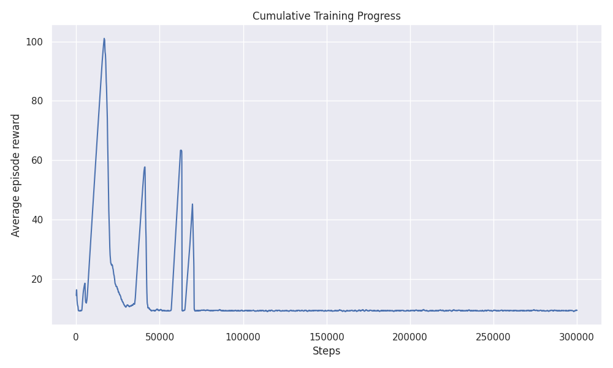
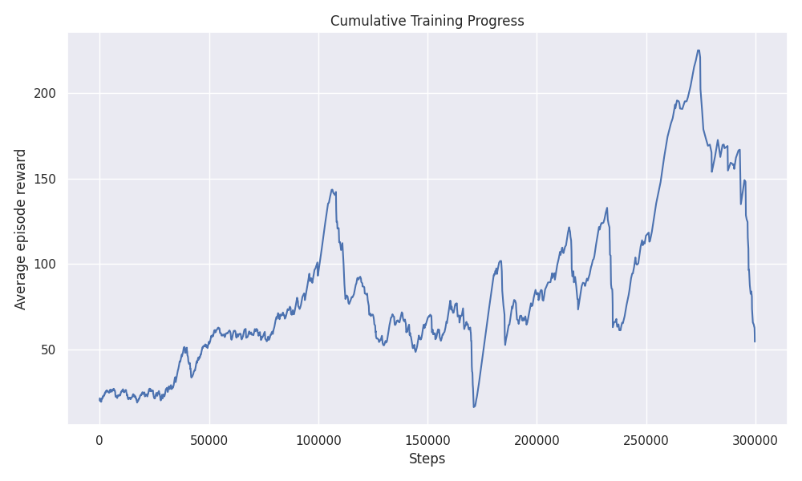
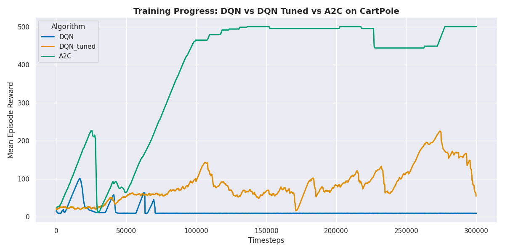
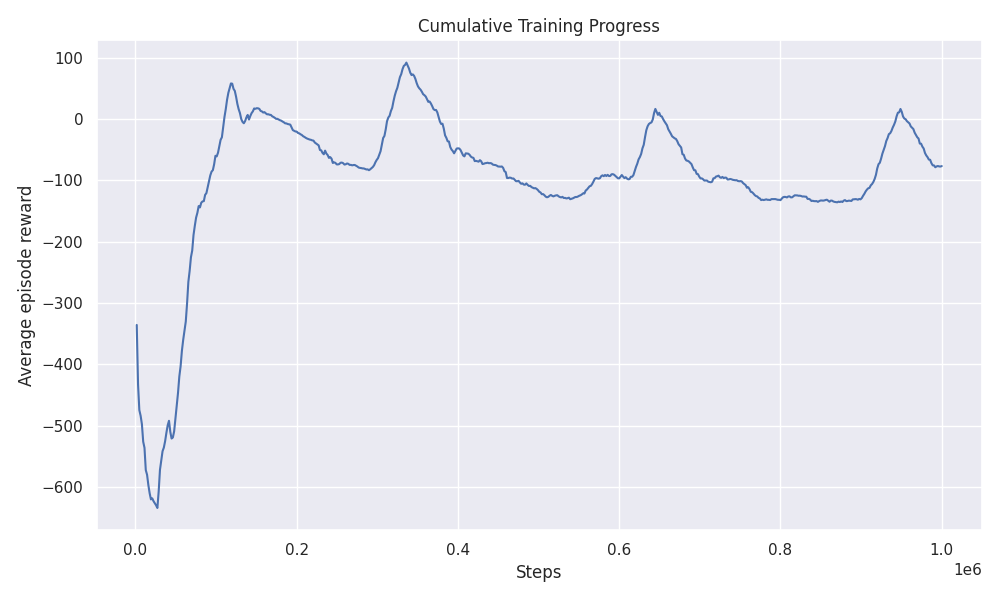
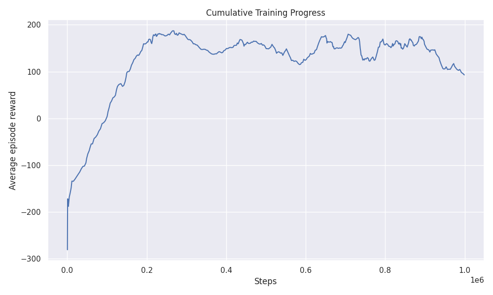
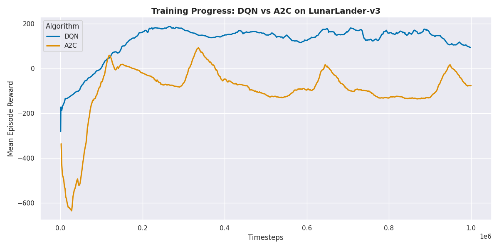
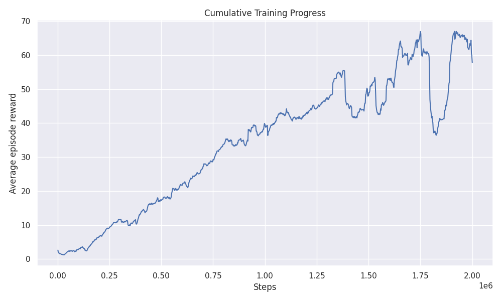
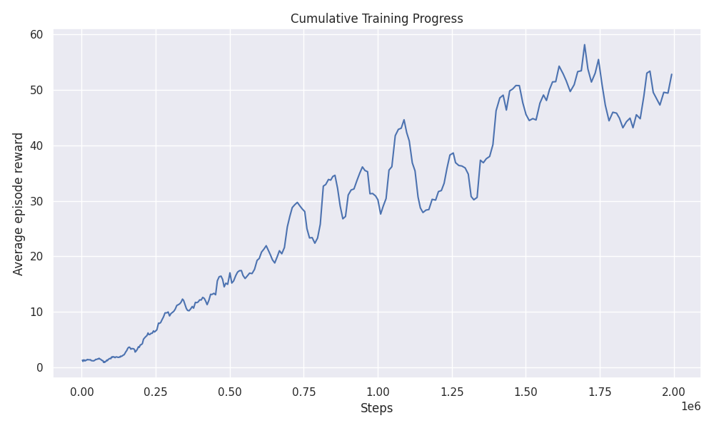
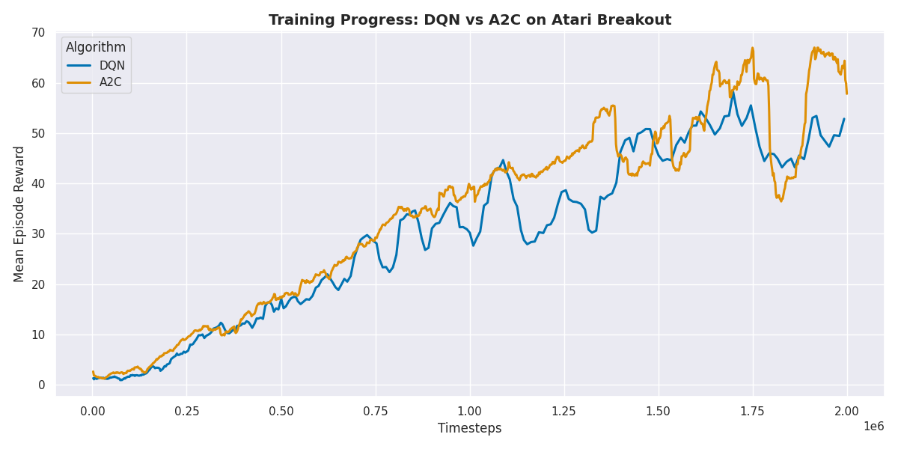

# **Comparing RL Algorithms from Stable-Baselines3 with Gymnasium Environments**

The goal of this project is to compare the performance of different reinforcement learning algorithms from the Stable-Baselines3 library on various Gymnasium environments. We will implement and evaluate the following algorithms:

- A2C (Advantage Actor-Critic)
- DQN (Deep Q-Network)

They will be used to solve the following environments:

- CartPole-v1
- LunarLander-v3
- Breakout-v4

## **Installing and running the experiments**

It is highly recommended to have a virtual environment and install the required packages to run these experiments:

```bash
# Create a virtual environment
python -m venv venv
# Activate the virtual environment
# On Windows
venv\Scripts\activate
# On macOS/Linux
source venv/bin/activate
# Install the required packages
pip install -r requirements.txt
```
Once dependencies are installed, you can run the experiments by running each of the python notebooks:

* `cartpole.ipynb`
* `lunar_lander.ipynb`
* `atari_breakout.ipynb`

## **File structure**

The output files for each experiment are stored in the following directories:

- `graphs/` - Contains the graphs saved for each environment.
- `models/` - Contains the models saved for each environment. They can be loaded in all notebooks to skip the training process.
- `results/` - Contains the logs saved for each environment. They include key data, especially average reward over time steps. This is the data used to plot the graphs.

---

# **1. CartPole** 

In the CartPole environment, the goal is to balance a pole on a cart. The cart can move left or right. The agent receives a reward for each time step the pole remains upright and a penalty if it falls over or the cart moves out of bounds.

We have tested the two different reinforcement learning algorithms mentioned previously. For A2C, we only tested the default hyperparameters, as it was already enough to learn the environment.

For DQN, the goal was to first test the default hyperparameters from the previous activities, to understand if there are differences in the implementation. However, given its poor results, we searched the internet for better hyperparameters to see if we could achieve better results. After searching for a bit we reached an open-source github repository, [rl-baselines3-zoo](https://github.com/DLR-RM/rl-baselines3-zoo), which has hyperparameters for different algorithms and environments. After using the ones provided for DQN we were able to achieve a better performance, but still fell far short of A2C’s optimal performance. This suggests that the Stable's version of DQN may lack the necessary stability mechanisms to generalize well in this simple, fast-paced environment. 

Each model was trained in 300k steps. The details of each implementation and hyperparameters can be found in the notebook. The results can be seen below in the individual graphs, and the last one comparing all 3 together:

## A2C



## DQN - Our Hyperparameters



## DQN - Hyperparameters from rl-baselines3-zoo



## Comparing Agents



## Conclusions

As we can see in the graphs, A2C was able to learn the environment very well, while DQN was not able to learn it at all. The hyperparameters we found online were able to improve the performance of DQN, but it was still far from A2C and could not survive for an entire episode. This points to a possible difference in the implementation of the DQN algorithm to our own.

It does not seem that more steps would help both DQN implementations to learn the environment, as they seem to have engaged in destructive behavior, where they are not able to learn anything new. More experiments in the future would be beneficial to understand if this is the case.

---

# **2. LunarLander**

In the LunarLander environment, the goal is to land a spacecraft on the lunar surface. The agent receives a reward for each time step it remains in the air and a penalty for crashing or landing too hard. The agent can control the thrust of the spacecraft's engines to adjust its position and velocity.

As it is a more complex environment, each agent was trained with 1M steps. The details of each implementation and hyperparameters can be found in the notebook. The results can be seen below in the individual graphs, and the last one comparing both together:

## A2C



## DQN



## Comparing Agents



## Conclusions

As seen in the graphs, the results were the opposite from the last environment. 

First, A2C could not break the 0 reward mark. Even after testing with tuned hyperparameters (from the rl-baselines3-zoo repository), it still could not reach the ideal 200 reward mark.

A possible explanation for this is that it got stuck in a local minimum, given to the lack of some characteristics that DQN possesses, such as experience replay and target networks.

DQN, on the other hand, was able to learn the environment very well. The hyperparameters used were the same from previous activities, and it was impressive how similar the learning process was to the one from the past activity with our own DQN implementation. In average, it was able to reach the 200 reward mark.

This trend is confirmed by the evaluation of the models:

## A2C

```
Mean reward: -52.4940013 +/- 78.68
```

## DQN

```
Mean reward: 155.78819349999998 +/- 97.37
```

## Comparison between implementations: `epsilon decay`

One of the findings of a big difference between our own implementation of DQN and the one from Stable-Baselines3 was the epsilon decay. In our implementation, we used a exponential decay, with `eps` being decayed by a factor every episode, while in the one from Stable-Baselines3, it is linear, calculating how much it has to decrease each episode to go from `initial_eps` to `final_eps` in `fraction` of the time steps provided.

To consider this, we converted our exponential decay from the last activity to a linear decay, following the formula:

```python
T = -math.log(final_eps / initial_eps) / decay

linear_fraction = T / total_steps
```

In this way, this could be one of the success reasons for DQN in this environment.

---

# **3. Atari Breakout**

The Atari Breakout environment has a significant differnce from the previous two. The environment is represented by a 2d image, and the agent has to learn how to play the game by observing the pixels. This represents a much more complex learning problem, as the agent has to learn how to extract features from the image and use them to make decisions.

Therefore, some key changes in the training process were made:

- The policy was changed to `CnnPolicy`, which is a convolutional neural network that can process images.
- All training was done in `cuda`.
- The `make_atari_env` and `VecFrameStack` features of Stable-Baselines3 were used to create a vectorized environment that stacks 4 frames of the game. Although the original goal was to rely purely on `gym`, the use of `make_atari_env` and `VecFrameStack` from Stable-Baselines3 was necessary. These wrappers ensure proper preprocessing (frame skipping, stacking, resizing), which significantly accelerates and stabilizes learning. Without them, the agent consistently failed to learn, even after extensive training. Not using these functions, in initial tests, resulted in the agent not being able to learn at all.
- Both agents were trained with 2M steps, as it is a more complex environment. Even then, to achieve the peak performance, the training should take even more steps, as the agent is still learning after 2M steps. However, this was not done due to time and hardware constraints.

The details of each implementation and hyperparameters can be found in the notebook. The results can be seen below in the individual graphs, and the last one comparing both together:

## A2C



## DQN



## Comparing Agents



## Conclusions

As seen in the graphs, both agents were able to learn the environment very similarly. The A2C agent was able to achieve slightly higher rewards, but the DQN agent was able to learn the environment very well too. As mentioned before, the training should take more steps to achieve the peak performance, and that was clear from the graphs, as both curves were still increasing after 2M steps.

Another interesting point is that the A2C agent seems to have a more stable learning process, as the curve is smoother than DQN, especially in the first 1M steps.

The evaluation of the models confirms this and makes it clearer, as the average reward is much higher for A2C, around 3 times higher than DQN:

### A2C

```
Mean reward: 181.1 +/- 60.36
```

### DQN

```
Mean reward: 49.0 +/- 11.65
```

# **Overall Conclusions**

In this project, we explored how A2C and DQN perform across three increasingly complex environments. The findings can be summarized:

- **CartPole-v1**: A2C significantly outperformed DQN. Even with tuned hyperparameters, DQN struggled to consistently solve the task, potentially due to instability in its implementation or differences in implementation.
- **LunarLander-v3**: DQN showed strong performance, while A2C failed to achieve positive rewards even with tuning. DQN’s use of experience replay and target networks likely helped it avoid local minima.
- **Breakout-v4**: Both algorithms learned effectively, with A2C achieving higher average rewards and smoother training curves. The use of image-based input and convolutional policies introduced more complexity, but both agents adapted well.

Each algorithm has strengths that vary by environment. DQN excels in tasks in which memory and stability can be helpful (like LunarLander), while A2C appears to work better in visual tasks and simple dynamics (like CartPole and Breakout).